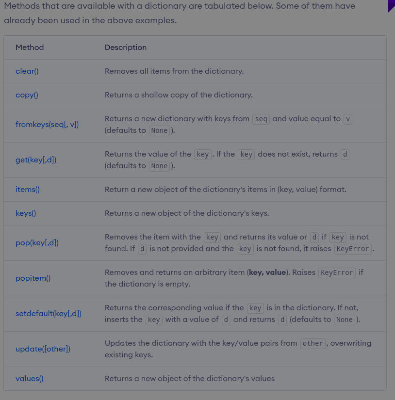

# Notes from exercise raindrops

## Instructions


## Solution

```python
# convert converts the sound of 'number' of raindrops. The function return the
# sound in a string format
def convert(number):
    sound = ''
    if number % 3 != 0 and number % 5 != 0 and number % 7 != 0:
        sound = str(number)
    if number % 3 == 0:
        sound += "Pling"
    if number % 5 == 0:
        sound += "Plang"
    if number % 7 == 0:
        sound += "Plong"

    return sound
```

## Feedback


## Alternative solution 1

```python
def convert(number):
    return ''.join(drop for divisor, drop in
                   {3: "Pling", 5: "Plang", 7: "Plong"}.items()
                   if number % divisor == 0) or str(number)
```

## Alternative solution 2

```python
 def convert(number):
     return ''.join(drop for divisor, drop in
                    [(3, "Pling"), (5, "Plang"), (7, "Plong")]
                    if number % divisor == 0) or str(number)
```

## Alternative solution 3

```python
 def convert(number):
     msg = ''.join(drop for divisor, drop in {3: "Pling", 5: "Plang",
                   7: "Plong"}.items() if number % divisor == 0)
     return msg if msg != '' else str(number)
```

## Alternative solution 4

```python
 def convert(number):
     msg = ''.join(drop for divisor, drop in [(3, "Pling"), (5, "Plang"),
                   (7, "Plong")] if number % divisor == 0)
     return msg if msg != '' else str(number)
```

## The join function

The join() method takes all items in an iterable and joins them into one string.

A string must be specified as the separator.

### Example of `join()`

```python
# Python program to demonstrate the
# use of join function to join list
# elements without any separator.
  
# Joining with empty separator
list1 = ['g','e','e','k', 's'] 
print("".join(list1))
```

gives the output:

```
geeks
```

## Crash course in dictinarys

Python dictionary is an unordered collection of items. Each item of a dictionary has a key/value pair.

Dictionaries are optimized to retrieve values when the key is known.

### Creating python dictionaries

Creating a dictionary is as simple as placing items inside curly braces {} separated by commas.

An item has a key and a corresponding value that is expressed as a pair (key: value).

While the values can be of any data type and can repeat, keys must be of immutable type (string, number or tuple with immutable elements) and must be unique.

```python
# Empty dictionary
my_dict = {}

# Dictionary with integer keyes
my_dict = {1: 'apple', 2: 'ball'}

# Dictionary with mixed keys
my_dict = {'name': 'John', 1: [2, 3, 4]}

# Dictionary using the command dict()
my_dict = dict({1: 'apple', 2: 'ball'})

# From sequence having each item as a pair
my_dict = dict([(1, 'apple'), (2, 'ball')])
```

### Accessing elements from dictionary

While indexing is used with other data types to access values, a dictionary uses keys. Keys can be used either inside square brackets [] or with the get() method.

If we use the square brackets [], KeyError is raised in case a key is not found in the dictionary. On the other hand, the get() method returns None if the key is not found.

```python
# get vs [] for retrieving elements
my_dict = {'name': 'Jack', 'age': 26}

# Output: Jack
print(my_dict['name'])

# Output: 26
print(my_dict.get('age'))

# Trying to access keys which doesn't exist throws error
# Output None
print(my_dict.get('address'))

# KeyError
print(my_dict['address'])
```

Output:

```
Jack
26
None
Traceback (most recent call last):
  File "<string>", line 15, in <module>
    print(my_dict['address'])
KeyError: 'address'
```
### Changing and adding dictionary elements

Dictionaries are mutable. We can add new items or change the value of existing items using an assignment operator.

If the key is already present, then the existing value gets updated. In case the key is not present, a new (key: value) pair is added to the dictionary.


```python
# Changing and adding Dictionary Elements
my_dict = {'name': 'Jack', 'age': 26}

# update value
my_dict['age'] = 27

#Output: {'age': 27, 'name': 'Jack'}
print(my_dict)

# add item
my_dict['address'] = 'Downtown'

# Output: {'address': 'Downtown', 'age': 27, 'name': 'Jack'}
print(my_dict)
```

Output:

```
{'name': 'Jack', 'age': 27}
{'name': 'Jack', 'age': 27, 'address': 'Downtown'}
```

### Removing elements from Dictionary

We can remove a particular item in a dictionary by using the pop() method. This method removes an item with the provided key and returns the value.

The popitem() method can be used to remove and return an arbitrary (key, value) item pair from the dictionary. All the items can be removed at once, using the clear() method.

We can also use the del keyword to remove individual items or the entire dictionary itself.

```python
# Removing elements from a dictionary

# create a dictionary
squares = {1: 1, 2: 4, 3: 9, 4: 16, 5: 25}

# remove a particular item, returns its value
# Output: 16
print(squares.pop(4))

# Output: {1: 1, 2: 4, 3: 9, 5: 25}
print(squares)

# remove an arbitrary item, return (key,value)
# Output: (5, 25)
print(squares.popitem())

# Output: {1: 1, 2: 4, 3: 9}
print(squares)

# remove all items
squares.clear()

# Output: {}
print(squares)

# delete the dictionary itself
del squares

# Throws Error
print(squares)
```

Output:

```
16
{1: 1, 2: 4, 3: 9, 5: 25}
(5, 25)
{1: 1, 2: 4, 3: 9}
{}
Traceback (most recent call last):
  File "<string>", line 30, in <module>
    print(squares)
NameError: name 'squares' is not defined
```

### Python dictionary methods



Here are a few example use cases of these methods.

```python
# Dictionary Methods
marks = {}.fromkeys(['Math', 'English', 'Science'], 0)

# Output: {'English': 0, 'Math': 0, 'Science': 0}
print(marks)

for item in marks.items():
    print(item)

# Output: ['English', 'Math', 'Science']
print(list(sorted(marks.keys())))
```

Output:

```
{'Math': 0, 'English': 0, 'Science': 0}
('Math', 0)
('English', 0)
('Science', 0)
['English', 'Math', 'Science']
```

### Python dictionary comprehension

Dictionary comprehension is an elegant and concise way to create a new dictionary from an iterable in Python.

Dictionary comprehension consists of an expression pair (key: value) followed by a for statement inside curly braces {}.

Here is an example to make a dictionary with each item being a pair of a number and its square.

```python
# Dictionary Comprehension
squares = {x: x*x for x in range(6)}

print(squares)
```

Output:

```
{0: 0, 1: 1, 2: 4, 3: 9, 4: 16, 5: 25}
```

This code is equivalent to:

```python
squares = {}
for x in range(6):
    squares[x] = x*x
print(squares)
```

Output:

```
{0: 0, 1: 1, 2: 4, 3: 9, 4: 16, 5: 25}
```

A dictionary comprehension can optionally contain more for or if statements.

An optional if statement can filter out items to form the new dictionary.

Here are some examples to make a dictionary with only odd items.

```python
# Dictionary Comprehension with if conditional
odd_squares = {x: x*x for x in range(11) if x % 2 == 1}

print(odd_squares)
```

Output:

```
{1: 1, 3: 9, 5: 25, 7: 49, 9: 81}
```

### Other dictionary operatorations

#### Dictionary membership test

We can test if a key is in a dictionary or not using the keyword in. Notice that the membership test is only for the keys and not for the values.

```python
# Membership Test for Dictionary Keys
squares = {1: 1, 3: 9, 5: 25, 7: 49, 9: 81}

# Output: True
print(1 in squares)

# Output: True
print(2 not in squares)

# membership tests for key only not value
# Output: False
print(49 in squares
```

Output:

```
True
True
False
```

#### Iterating though a dictionary

We can iterate through each key in a dictionary using a for loop.

```python
# Iterating through a Dictionary
squares = {1: 1, 3: 9, 5: 25, 7: 49, 9: 81}
for i in squares:
    print(squares[i])
```

Output:

```
1
9
25
49
81
```

#### Dictionary built in functions

Built-in functions like all(), any(), len(), cmp(), sorted(), etc. are commonly used with dictionaries to perform different tasks.


Here are some examples that use built-in functions to work with a dictionary.

```python
# Dictionary Built-in Functions
squares = {0: 0, 1: 1, 3: 9, 5: 25, 7: 49, 9: 81}

# Output: False
print(all(squares))

# Output: True
print(any(squares))

# Output: 6
print(len(squares))

# Output: [0, 1, 3, 5, 7, 9]
print(sorted(squares))
```

Output:

```
False
True
6
[0, 1, 3, 5, 7, 9]
```
## Python dictionary comprehension

In this tutorial, we will learn about Python dictionary comprehension and how to use it with the help of examples.

Dictionaries are data types in Python which allows us to store data in key/value pair. For example:

```python
my_dict = {1: 'apple', 2: 'ball'}
```

### What is a dictionary comprehension in python

Dictionary comprehension is an elegant and concise way to create dictionaries.

#### Example 1: Dictionary comprehension

Consider the following code:

```python
square_dict = dict()
for num in range(1, 11):
    square_dict[num] = num*num
print(square_dict)
```

Now, let's create the dictionary in the above program using dictionary comprehension.

```python
# dictionary comprehension example
square_dict = {num: num*num for num in range(1, 11)}
print(square_dict)
```

The output of both programs will be the same.

```
{1: 1, 2: 4, 3: 9, 4: 16, 5: 25, 6: 36, 7: 49, 8: 64, 9: 81, 10: 100}
```
In both programs, we have created a dictionary square_dict with number-square key/value pair.

However, using dictionary comprehension allowed us to create a dictionary in a single line.

### Using dictionary comprehension

From the above example, we can see that dictionary comprehension should be written in a specific pattern.

The minimal syntax for dictionary comprehension is:

```python
dictionary = {key: value for vars in iterable}
```

Let's compare this syntax with dictionary comprehension from the above example.


Now, let's see how we can use dictionary comprehension using data from another dictionary.

```python
#item price in dollars
old_price = {'milk': 1.02, 'coffee': 2.5, 'bread': 2.5}

dollar_to_pound = 0.76
new_price = {item: value*dollar_to_pound for (item, value) in old_price.items()}
print(new_price)
```

Output

```
{'milk': 0.7752, 'coffee': 1.9, 'bread': 1.9}
```

Here, we can see that we retrieved the item prices in dollars and converted them to pounds. Using dictionary comprehension makes this task much simpler and shorter.

### Conditionals in dictionary comprehension

We can further customize dictionary comprehension by adding conditions to it. Let's look at an example.

```python
original_dict = {'jack': 38, 'michael': 48, 'guido': 57, 'john': 33}

even_dict = {k: v for (k, v) in original_dict.items() if v % 2 == 0}
print(even_dict)
```

Output:

```
{'jack': 38, 'michael': 48}
```

As we can see, only the items with even value have been added, because of the if clause in the dictionary comprehension.

```python
original_dict = {'jack': 38, 'michael': 48, 'guido': 57, 'john': 33}

new_dict = {k: v for (k, v) in original_dict.items() if v % 2 != 0 if v < 40}
print(new_dict)

```

Output:

```
{'john': 33}
```

In this case, only the items with an odd value of less than 40 have been added to the new dictionary.

It is because of the multiple if clauses in the dictionary comprehension. They are equivalent to and operation where both conditions have to be true.

```python
original_dict = {'jack': 38, 'michael': 48, 'guido': 57, 'john': 33}

new_dict_1 = {k: ('old' if v > 40 else 'young')
    for (k, v) in original_dict.items()}
print(new_dict_1)
```

Output:

```
{'jack': 'young', 'michael': 'old', 'guido': 'old', 'john': 'young'}
```

In this case, a new dictionary is created via dictionary comprehension.

The items with a value of 40 or more have the value of 'old' while others have the value of 'young'.


### Nested dictionary comprehension

We can add dictionary comprehensions to dictionary comprehensions themselves to create nested dictionaries. Let's look at an example.

```python
dictionary = {
    k1: {k2: k1 * k2 for k2 in range(1, 6)} for k1 in range(2, 5)
}
print(dictionary)
```

Output:

```
{2: {1: 2, 2: 4, 3: 6, 4: 8, 5: 10}, 
3: {1: 3, 2: 6, 3: 9, 4: 12, 5: 15},
4: {1: 4, 2: 8, 3: 12, 4: 16, 5: 20}}
```

As you can see, we have constructed a multiplication table in a nested dictionary, for numbers from 2 to 4.

Whenever nested dictionary comprehension is used, Python first starts from the outer loop and then goes to the inner one.

So, the above code would be equivalent to:

```python
dictionary = dict()
for k1 in range(11, 16):
    dictionary[k1] = {k2: k1*k2 for k2 in range(1, 6)}
print(dictionary)
```

It can further be unfolded:

```python
dictionary = dict()
for k1 in range(11, 16):
    dictionary[k1] = dict()
    for k2 in range(1, 6):
        dictionary[k1][k2] = k1*k2
print(dictionary)
```

All these three programs give us the same output.

### Advantages of using dictionary comprehension

As we can see, dictionary comprehension shortens the process of dictionary initialization by a lot. It makes the code more pythonic.

Using dictionary comprehension in our code can shorten the lines of code while keeping the logic intact.

### Warnings on using dictionary comprehension

Even though dictionary comprehensions are great for writing elegant code that is easy to read, they are not always the right choice.

We must be careful while using them as :

* They can sometimes make the code run slower and consume more memory.
* They can also decrease the readability of the code.

We must not try to fit a difficult logic or a large number of dictionary comprehension inside them just for the sake of making the code single lined. In these cases, It is better to choose other alternatives like loops.

## Ternary operators

Ternary operators are more commonly known as conditional expressions in Python. These operators evaluate something based on a condition being true or not. They became a part of Python in version 2.4

Here is a blueprint and an example of using these conditional expressions.

**Blueprint:**

```python
value_if_true if condition else value_if_false
```

**Example:**

```python
is_nice = True
state = "nice" if is_nice else "not nice"
```

It allows to quickly test a condition instead of a multiline if statement. Often times it can be immensely helpful and can make your code compact but still maintainable.

Another more obscure and not widely used example involves tuples. Here is some sample code:

**Blueprint:**

```python
(if_test_is_false, if_test_is_true)[test]
```

**Example:**

```python
nice = True
personality = ("mean", "nice")[nice]
print("The cat is ", personality)
# Output: The cat is nice
```

This works simply because True == 1 and False == 0, and so can be done with lists in addition to tuples.

The above example is not widely used and is generally disliked by Pythonistas for not being Pythonic. It is also easy to confuse where to put the true value and where to put the false value in the tuple.

Another reason to avoid using a tupled ternery is that it results in both elements of the tuple being evaluated, whereas the if-else ternary operator does not.

**Example:**

```python
condition = True
print(2 if condition else 1/0)
#Output is 2

print((1/0, 2)[condition])
#ZeroDivisionError is raised
```

This happens because with the tupled ternary technique, the tuple is first built, then an index is found. For the if-else ternary operator, it follows the normal if-else logic tree. Thus, if one case could raise an exception based on the condition, or if either case is a computation-heavy method, using tuples is best avoided.

**ShortHand Ternary**

In python there is also the shorthand ternary tag which is a shorter version of the normal ternary operator you have seen above.

Syntax was introduced in Python 2.5 and can be used in python 2.5 or greater.

**Example**

```python
>>> True or "Some"
True
>>>
>>> False or "Some"
'Some'
```

The first statement (True or “Some”) will return True and the second statement (False or “Some”) will return Some.

This is helpful in case where you quickly want to check for the output of a function and give a useful message if the output is empty:

```python
>>> output = None
>>> msg = output or "No data returned"
>>> print(msg)
No data returned
```

Or as a simple way to define function parameters with dynamic default values:

```python
>>> def my_function(real_name, optional_display_name=None):
>>>     optional_display_name = optional_display_name or real_name
>>>     print(optional_display_name)
>>> my_function("John")
John
>>> my_function("Mike", "anonymous123")
anonymous123
```

